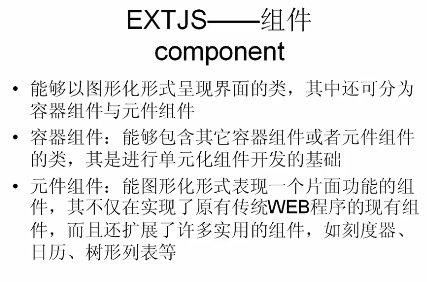
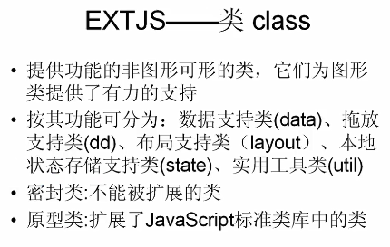
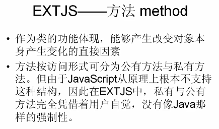
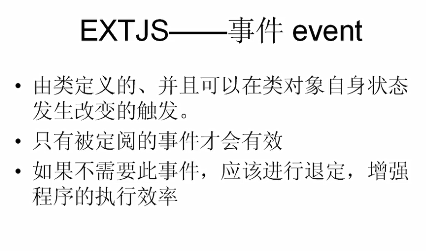
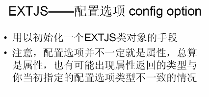
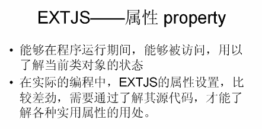
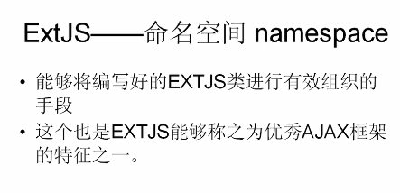
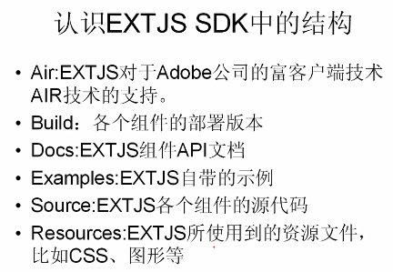
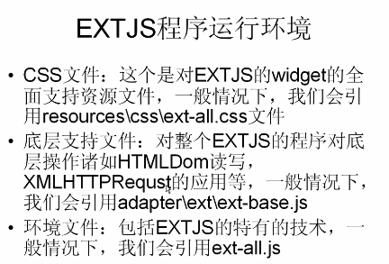

# ExtJS
> 组件
> 类
> 方法
> 事件
> 配置选项
> 属性
> 命名空间

## 1. 组件

## 2. 类

## 3. 方法

## 4. 事件

## 5. 配置选项

## 6. 属性

## 7. 命名空间

## 8. ExtJS SDK结构

## 9. ExtJS 程序运行环境

# 下载地址
Extjs最新版下载链接：http://www.sencha.com/products/extjs/download/

其它版本下载：
6.2.0
ExtJs6.2.0-GPL版本  本站下载  官网下载  链接：https://pan.baidu.com/s/1CAmRCGBlHgbFROhUAmijyw 提取码：vd7z
6.0.0
ExtJs6.0.0-GPL版本  本站下载  官网下载  链接：https://pan.baidu.com/s/1Q9FtblGwr0tF5lc2LBUWQQ 提取码：dgj3
5.0.0
ExtJs5.0.0-GPL版本  本站下载  官网下载  链接：https://pan.baidu.com/s/1I5jwPpd_Wsl8chbxY3mp4g 提取码：xb1y
4.0.0
ExtJs4.0.0  本站下载  链接：https://pan.baidu.com/s/1OHQFSVrpE9OgXot95WB8Pg 提取码：mpi3
3.4.0
ExtJs3.4.0  本站下载  链接：https://pan.baidu.com/s/1gcyG0SIsQgt3KK9ychShig 提取码：p34m
3.0.0
ExtJs3.0.0  本站下载  链接：https://pan.baidu.com/s/1svaO0JFAezeKhVfDyRypWg 提取码：aw0k

# ExtJS 所支持的内容
## 1. 支持命名空间
- Ext.namespace("Ext.zichen");
- 对应java：
    - package Ext.zichen;