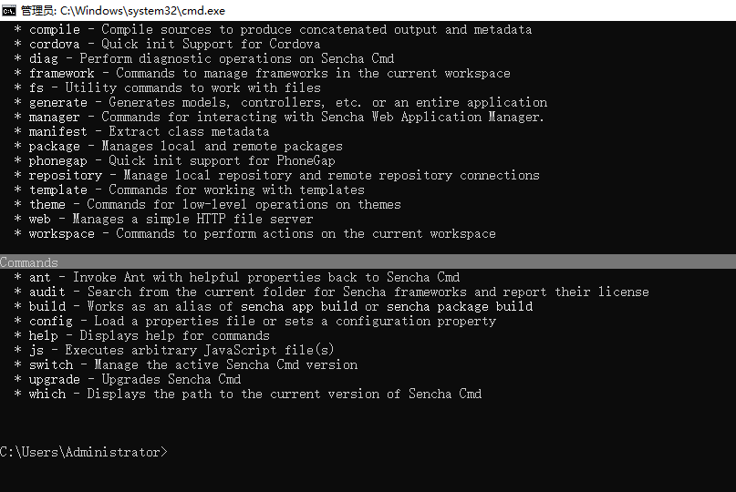
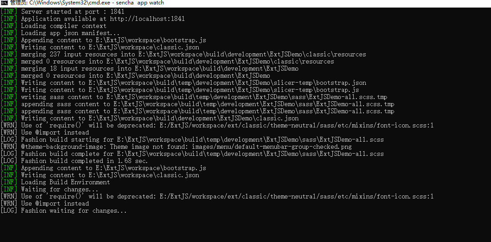
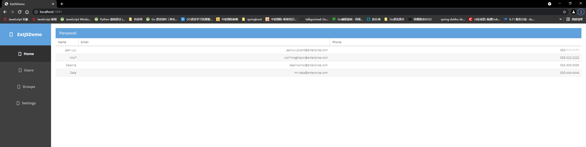
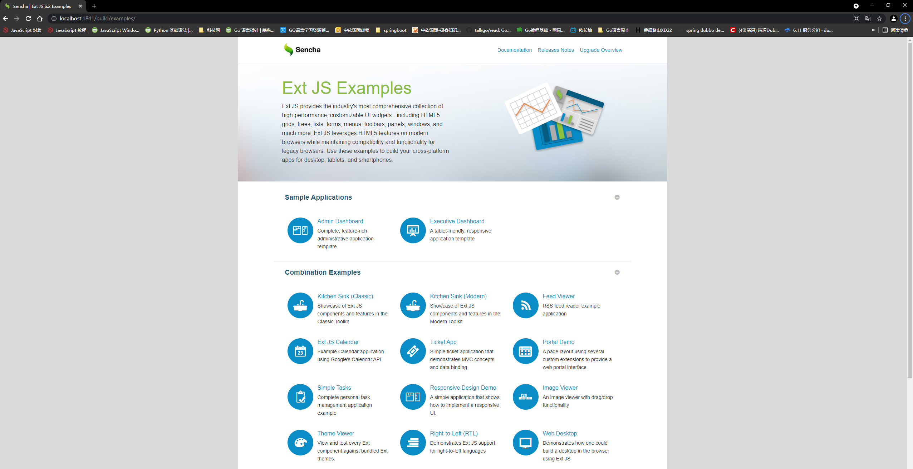
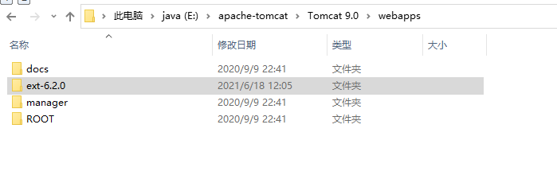

# ExtJS环境变量搭建（本地）
## 1. 准备工具
- cmd : E:\ExtJS\Cmd\7.2.0.84   [cmd下载地址](https://www.sencha.com/products/extjs/cmd-download/)
- sdk : E:\ExtJS\ext-6.2.0-gpl   [sdk下载地址](https://www.sencha.com/products/extjs/evaluate/)

## 2. 安装步骤
- 1. 解压 SenchaCmd-7.2.0.84-windows-64bit.zip ，指定目录（E:\ExtJS\Cmd\7.2.0.84）
- 2. 点击安装解压后的文件 SenchaCmd-7.2.0.84-windows-64bit.exe
- 3. 打开Windows的cmd，测试安装成功与否 
  - sencha help

- 4. 配置环境变量
  - EXTJS_CMD_HOME=E:\ExtJS\Cmd\7.2.0.84
  - path=%E:\ExtJS\Cmd\7.2.0.84%
## 3. 新建ExtJS项目
- 1. 创建项目
  - 使用cmd： sencha -sdk E:\ExtJS\ext-6.2.0-gpl\ext-6.2.0 generate app ExtJSDemo E:\ExtJS\workspace\ExtJSDemo
  - 解释： sencha -sdk [解压后的ext-6.2.0的位置] generate app [项目名称] [项目地址]

## 4. 运行ExtJS项目
- 在你创建的ExtJs项目目录下执行命令： sencha app watch

  
- 访问： localhost:1841

  
## 5. 注意，想运行那个项目，就切换到那个项目目录执行 sencha app watch
- 运行ExtJS6.2.0自带的项目
  - 切到E:\ExtJS\ext-6.2.0-gpl\ext-6.2.0\templates\admin-dashboard目录，执行 sencha app watch
  
- 访问： http:localhost:1841/build/examples
  

# Tomcat 方式启动
## 1. 将ext-6.2.0放入Tomcat的webapps目录下

## 2. 启动Tomcat
- E:\apache-tomcat\Tomcat 9.0\bin\startup.bat

## 3. 访问：http://localhost:8080/ext-6.2.0
- 结果是不可访问资源，待解决