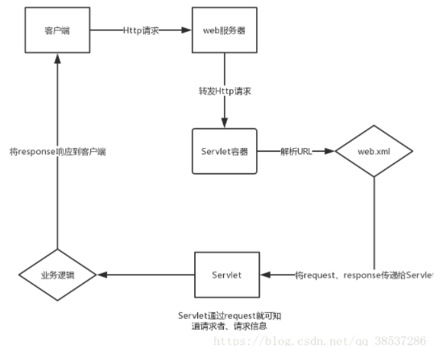

# javaweb
## 1. JavaWeb三大组件之 Servlet
### 1. B <---> Servlet <---> S
### 2. 执行流程
|web客户端| ---request---> |web服务器| ---转发request---> |Servlet容器| ---根据web.xml解析请求的URL地址，得到对应的servlet，然后将request和response发送给找的的servlet---> |java层逻辑代码| ---将response响应给客户端---> |web客户端|

### 3. 

## 2. JavaWeb 三大组件之 Filter

## 3. JavaWeb 三大组件之 Listener